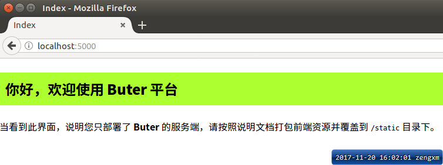

# Buter
> 基于 `Docker`  的远程应用部署管理平台

注意：此项目仅为 REST Server ，需配合 [buter-admin](https://github.com/0604hx/buter-admin) 使用


## 相关库

* [Flask](https://github.com/pallets/flask)
* [sqlalchemy](https://github.com/zzzeek/sqlalchemy)
* [flask-sqlalchemy](https://github.com/mitsuhiko/flask-sqlalchemy)
* [docker-py](https://github.com/docker/docker-py)
* [Flask-APScheduler](https://github.com/viniciuschiele/flask-apscheduler)

**打包**

* [pyInstaller](http://www.pyinstaller.org)

更多 `pyInstaller` 的说明详见[这里](https://pyinstaller.readthedocs.io/en/stable/usage.html)


## 如何打包

执行 `package.py` 即可打包（默认打包成单个可执行文件存放到 `dist` 目录，`windows` 平台为 `buter.exe`，Linux/mac OS 为 `buter`）

完整的项目运行目录如下：

```text
|- static/              # 静态资源，buter-admin 项目打包后复制到此处
|- logs/                # 日志文件
|- buter.exe            # 主程序
|- setting.py           # 额外的配置文件，覆盖默认配置
```

### 如何在 Ubuntu 下打包
> 下面将在 `ubuntu 16.04 64bit` 中打包， python版本为预装的 `3.5.2`

1. 安装pip、virtualenv： sudo apt-get install python-pip3 && pip3 install virtualenv
2. 创建项目专用虚拟环境（目录自定）：virtualenv buter
3. 拉取最新的代码：git clone https://www.github.com/0604hx/buter.git
4. 进入 buter 虚拟环境：source buter/bin/activate
5. 进入 buter 的源码目录：cd /{YOUR_PATH_OF_BUTER_PROJECT}
6. 安装依赖： pip3 install -r requirements.txt
7. 执行打包：python package.py
8. 退出虚拟环境：deactivate


安装完成后建议执行 python run.py ，然后访问 `http://localhost:5000` 如果出现以下界面表示成功了^.^




### 问题汇总

**windows下运行打包后exe提示：缺失 api-ms-win-crt-runtime-11-1-0.dll**

参考资料：[Universal CRT not found building with Py3.5 on Win10 (Python 3.5 not usable on Windows)](https://github.com/pyinstaller/pyinstaller/issues/1566#issuecomment-146564554)

原因： `windows 10`缺失的 dll 为系统自带的链接库，如果在运行时提示缺失，请安装 
[Windows 10 Universal C Runtime](https://www.microsoft.com/en-us/download/details.aspx?id=48234)

此问题暂没有很好解决，经测试在 windows10 下打包的程序可以运行在 win8/win8.1/windows 10 平台

**ubuntu 下打包出现 `Unable to find "xxx/buter/include/python3.5m/pyconfig.h" when adding binary and data files.`的错误**

黑科技：在缺失的位置创建空的 `pyconfig.h` 即可 =.=


### 附录

#### python script template

```text
# encoding: utf-8

#set( $SITE = "https://github.com/0604hx" )

"""
@author     0604hx
@license    MIT 
@contact    zxingming@foxmail.com
@site       ${SITE}
@software   ${PRODUCT_NAME}
@project    ${PROJECT_NAME}
@file       ${NAME}.py
@time       ${DATE} ${TIME}
"""


```

## LOGS

### 0.0.1

- [x] 环境检测（os、python、docker）
- [x] Application 数据对象`CURD`
- [x] 部署`Java`应用
- [ ] 使用`https`协议: `pip install pyOpenSSL`