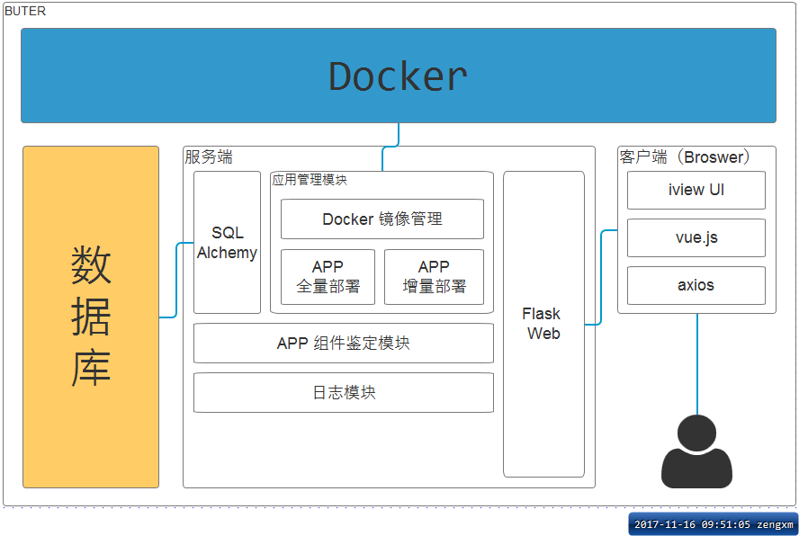

# Buter
> 基于 `Docker`  的远程应用部署管理平台

## 相关库

* [Flask](https://github.com/pallets/flask)
* [sqlalchemy](https://github.com/zzzeek/sqlalchemy)
* [flask-sqlalchemy](https://github.com/mitsuhiko/flask-sqlalchemy)
* [docker-py](https://github.com/docker/docker-py)

**打包**

* [pyInstaller](http://www.pyinstaller.org)

更多 `pyInstaller` 的说明详见[这里](https://pyinstaller.readthedocs.io/en/stable/usage.html)

## LOGS

### 0.0.1

- [ ] 环境检测（os、python、docker）
- [ ] Application 数据对象`CURD`
- [ ] 部署`Java`应用