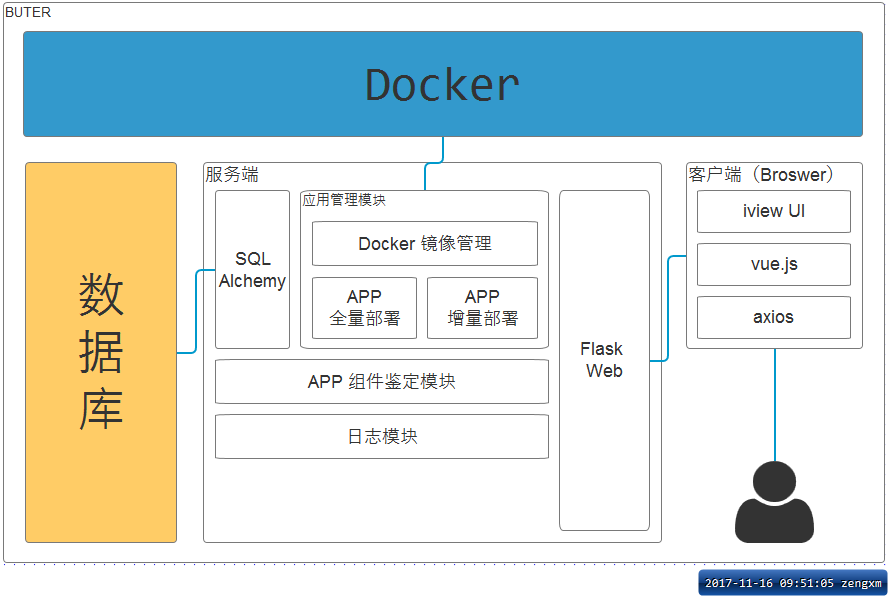

# Buter

基于`Docker`的远程应用部署管理平台（断网环境）

**场景**

客户环境不能上外网，部署系统只能先拷贝到内网然后登陆服务器，迭代更新亦然。同时还要满足应用自启动，可以通过`UI`界面进行操作（如启动、关闭、打补丁等）。

`buter`应运而生，利用`Docker`管理应用生命周期并提供人性化的操作界面，支持迭代式更新（只需要传输体积较小的文件给客户而非完整的程序包），支持`Java`、`Python`、`Node.js`等应用。

## 数据定义

详见：[db.md](db.md)

## 应用管理模块
> 这里的应用（Application）指的是交付给客户的产品，通常是基于`web`的后端程序

对于`buter`来说，标准的应用部署流程为：

1. 开发者打包应用并制作成 `Docker Image`（通常是`tar`后缀的文件）
2. 客户接受上述的镜像文件，上传到`buter`后加载入`docker`
3. 用上一步得到的镜像创建容器以运行应用
4. 当应用需要迭代更新时，重复上述流程

### Docker 镜像管理

**为什么需要镜像管理？** 

由于在客户服务器上无法使用`docker pull`下载镜像，则需使用`docker import/load`命令来加载应用镜像，这一步可以交由`buter`完成

[如何在python中使用docker？](docker-sdk.md)

## LOGS
