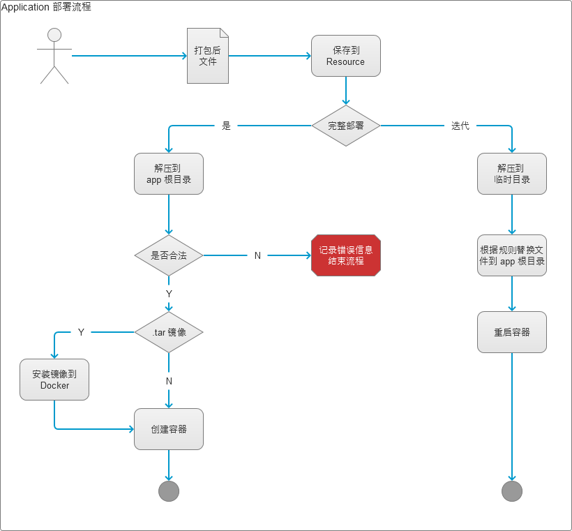

# 应用部署
> 应用部署分为`完整部署`、`迭代部署`两种模式




**如何判定合法性？**
> 用户上传的文件要求为`zip`格式的压缩文件

对于`完整部署`的应用，标准的目录结构如下（解压后）：

```text
|- image@version.tar
|- app.zip / app
|- run.txt
|- README.md
```

`tar`文件为`docker save/export` 得到的文件，用于执行 `docker load`命令

`zip`文件为应用相关文件，将被解压到应用根目录（`{程序目录}/apps/{app名称}`）

`run.txt` 保存的是`docker create`命令，命令中可以包含以下占位符（格式 `#变量名#`，如 `#name#` 将会被变量`name`替换），系统内置变量有：

* `app.name`    应用名称（仅包含字母跟数字）
* `app.path`    应用根目录
* `app.id`      应用 ID，如 1,2

## 应用状态

### 状态定义

应用状态即为对应容器的状态，用`stat`表示，可选值有：

状态码|说明
-----------|-----------
-1|并未创建容器
0|容器已经创建但未运行
1|容器正在运行

### 获取状态
> 提供`app/stats`接口，查看应用状态，接受的参数为`name=n1,n2,n3`

调用 `docker` 接口获取对应名称的容器状态，返回格式如下：

```json
//查询成功返回示例
{
    "success":true,
    "data":{
        "name1":-1,
        "name2":0,
        "name3":1
    }
}

//查询失败返回示例
{
    "success":false,
    "message":"无法查询容器状态，请检查 Docker 是否运行"
}
```
